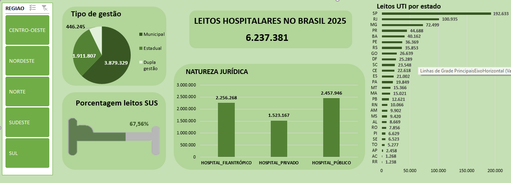

# analise-dados-saude
Projeto de análise de dados na área da saúde utilizando Excel/ Power BI
# 📊 Análise de Leitos Hospitalares no Brasil – 2025

## 📌 Sobre o Projeto
Este projeto apresenta um dashboard desenvolvido em Excel com o objetivo de analisar a distribuição de leitos hospitalares no Brasil em 2025.
## 📊 Fonte dos Dados
Dados públicos do CNES / DATASUS (Ministério da Saúde).

A análise contempla aspectos como:
- Tipo de gestão
- Natureza jurídica
- Percentual de leitos SUS
- Distribuição de leitos de UTI por estado
- Filtro por região

O objetivo é gerar insights estratégicos para apoio à tomada de decisão na área da saúde.

---

## 🎯 Problema de Negócio
Como os leitos hospitalares estão distribuídos no Brasil?
Existe concentração regional?
Qual a participação do SUS?
Qual o perfil jurídico predominante?

---

## 🛠 Ferramentas Utilizadas
- Excel (Power Query, Tabelas Dinâmicas e Gráficos)
- Modelagem de dados
- Tratamento e organização de base pública

(Em breve versão em Power BI)

---

## 📈 Principais Indicadores Analisados
- Total de leitos no Brasil
- Leitos por tipo de gestão (Municipal, Estadual, Dupla gestão)
- Percentual de leitos SUS
- Leitos por natureza jurídica (Filantrópico, Privado, Público)
- Leitos de UTI por estado

---

## 💡 Principais Insights
- Forte concentração de leitos na região Sudeste.
- Hospitais públicos representam a maior parcela da natureza jurídica.
- Mais de 67% dos leitos estão vinculados ao SUS.
- Disparidade significativa entre estados na oferta de UTI.

---

## 📷 Visual do Dashboard

---

## 🚀 Próximos Passos
- Construção da versão em Power BI
- Inclusão de análise temporal
- Cálculo de indicadores per capita
- Análise comparativa por região

---

## 👩‍💻 Sobre Mim
Profissional da área administrativa com foco em transição para Análise de Dados.
Experiência prática com Excel e desenvolvimento de dashboards analíticos na área da saúde.
